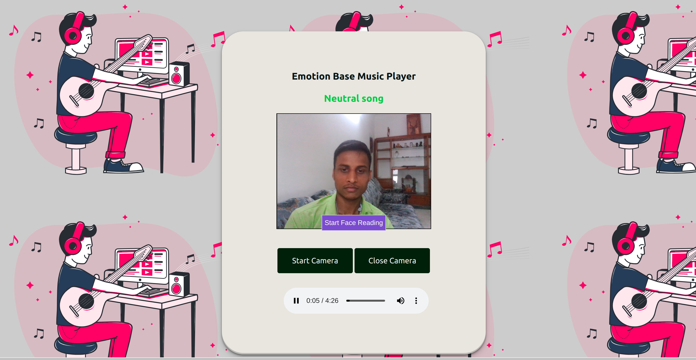

# Emotion-Based-MusicPlayer

Step 1 Create conda environment 
 
conda create -n myenv python=3.9

Step 2 install requirements.txt file

pip install -r requirements.txt
     
Step 3 get data set using following link

Step 4 train model
 

