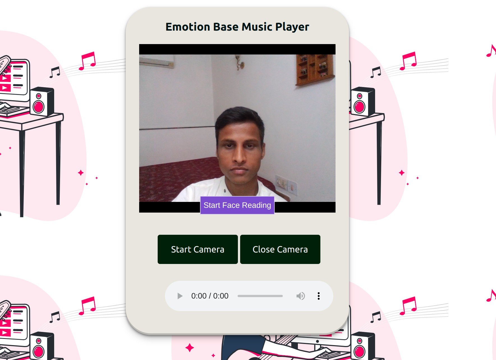
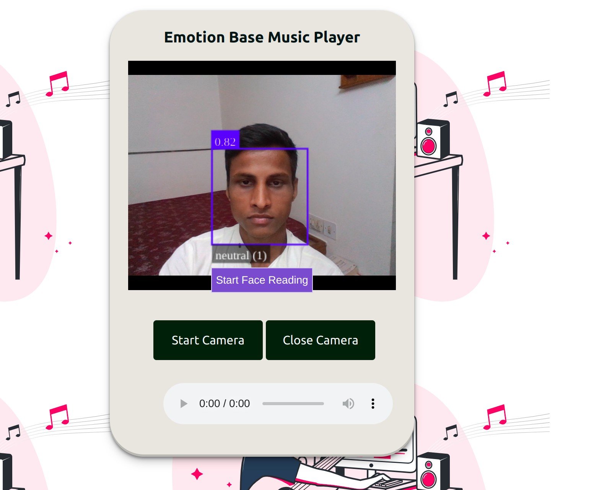

# Emotion-Based-MusicPlayer

“Emotion-based music player” captures the user's emotion using a webcam from the front end and plays music according to the emotion. For example if the user's facial expression is sad then the application would play a sad song. 

Step 1 Create conda environment 
 
conda create -n myenv python=3.9

Step 2 install requirements.txt file

pip install -r requirements.txt
     
Step 3 get data set using following link

Step 4 train model
